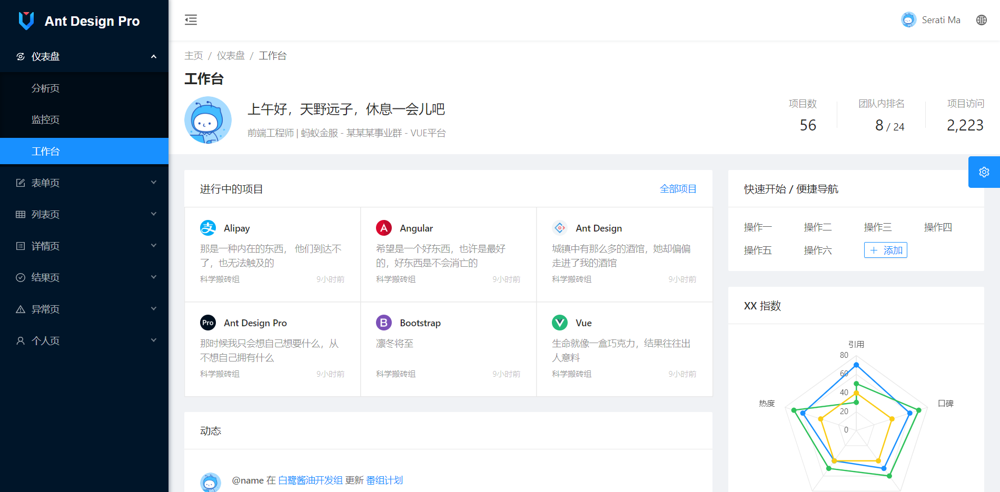

# Ant Design Vue Pro for Vue3 vite

本项目基于 [Vite](https://vitejs.dev/)、[Ant Design Vue 4.x](https://www.antdv.com/) 和 TypeScript 搭建，旨在为中后台管理系统开发提供高效、现代化的前端工程化解决方案。

<div align="center">

[](https://github.com/vueComponent/ant-design-vue-pro/blob/master/LICENSE)
[](https://github.com/vueComponent/ant-design-vue-pro/releases/latest)
[](https://github.com/vueComponent/ant-design-vue-pro/releases/latest)
[](https://travis-ci.org/vueComponent/ant-design-vue-pro)

</div>

- 预览: 
- 首页: 
- 文档: 
- 后端演示thinkPhp8 [仓库地址](https://gitee.com/sxl5188/thinkphp8.git)

## Overview

基于 Ant Design of Vue 实现的 Ant Design Pro



## 环境和依赖

- node
- pnpm
- vite
- eslint
- @vue/cli

> 请注意，我们强烈建议本项目使用 pnpm 包管理工具，这样可以与本项目演示站所加载完全相同的依赖版本 (pnpm-lock.yaml) 。由于我们没有对依赖进行强制的版本控制，采用非 - 包管理进行引入时，可能由于 Pro 所依赖的库已经升级版本而引入了新版本所导致的问题。作者可能会由于时间问题无法及时排查而导致您采用本项目作为基项目而出现问题。

## 项目下载和运行

- 拉取项目代码

```bash
git clone https://github.com/sunxl5188/ant-design-vue.git
cd ant-design-vue
```

- 安装依赖

```
pnpm install
```

- 开发模式运行

```
npm run dev
```

- 编译项目

```
npm run build
```


- 项目使用的 [vite](https://cn.vitejs.dev/), 请确保你所使用的 vite 是新版，并且已经学习 vite 官方文档使用教程


- [修改 Ant Design 配色 (@kokoroli)](https://github.com/kokoroli/antd-awesome/blob/master/docs/Ant_Design_%E6%A0%B7%E5%BC%8F%E8%A6%86%E7%9B%96.md)

- I18n: [多语言支持 (@musnow)](./src/i18n/index.ts)

- 生产环境默认不加载 `mock`，更多详情请看 `src/mock/index.js`

## 浏览器兼容

Modern browsers and IE10.

| [](http://godban.github.io/browsers-support-badges/)</br>IE / Edge | [](http://godban.github.io/browsers-support-badges/)</br>Firefox | [](http://godban.github.io/browsers-support-badges/)</br>Chrome | [](http://godban.github.io/browsers-support-badges/)</br>Safari | [](http://godban.github.io/browsers-support-badges/)</br>Opera |
| --------------------------------------------------------------------------------------------------------------------------------------------------------------------------------------------------------------- | ----------------------------------------------------------------------------------------------------------------------------------------------------------------------------------------------------------------- | ------------------------------------------------------------------------------------------------------------------------------------------------------------------------------------------------------------- | ------------------------------------------------------------------------------------------------------------------------------------------------------------------------------------------------------------- | --------------------------------------------------------------------------------------------------------------------------------------------------------------------------------------------------------- |
| IE10, Edge                                                                                                                                                                                                      | last 2 versions                                                                                                                                                                                                   | last 2 versions                                                                                                                                                                                               | last 2 versions                                                                                                                                                                                               | last 2 versions                                                                                                                                                                                           |


## 技术栈
- Vite：极速的前端构建工具，支持热更新和现代开发体验
- Ant Design Vue 4.x：企业级 UI 组件库，风格统一、组件丰富
- TypeScript：强类型开发，提升代码可维护性和开发效率
- Pinia：新一代状态管理方案
- Vue Router 4.x：路由管理

## 主要特性
- 现代化工程化配置，开箱即用
- 支持主题切换、国际化、权限控制等常用中后台功能
- 代码结构清晰，便于二次开发和扩展

## 适用场景
适用于企业级中后台管理系统、数据可视化平台、运营后台等前端项目。

---
如需快速开始、开发文档或二次开发建议，请参考项目内详细说明或 issue 区提问。
